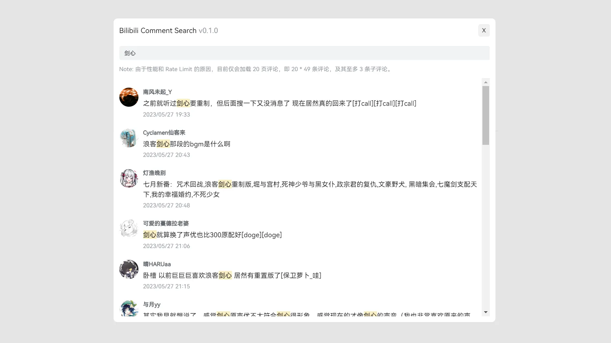

# Bilibili Comment Search

让 Bilibili 支持评论搜索。

[在 Greasyfork 上安装脚本](https://greasyfork.org/zh-CN/scripts/467863-bilibili-comment-search)

## 工作原理

脚本会在 Bilibili 视频页的评论区添加“搜索评论”按钮，用户点击时，将打开对话框并获取所有评论。在对话框中，用户可以输入关键词并按下 <kbd>Enter</kbd> 来搜索特定评论。评论获取完成后，包含关键字的评论会显示在对话框中。

## 限制

为了提高性能并避免达到请求速率的限制，目前仅会加载 20 页评论，即 20 \* 49 条评论，以及每条评论的最多 3 条子评论。

## License

MIT
